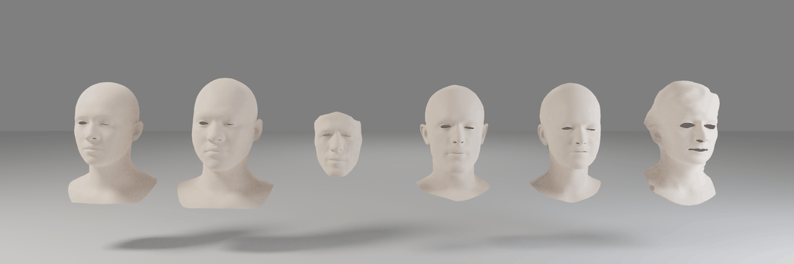

# PDB: Point-Based Deformation Blending for Facial Animation Retargeting



<!-- <a href="">.svg" height=22.5></a> -->
<a href="https://chacorp.github.io/PDB/"></a>

This is the official implementation

## TODOs
- [x] Installation
- [x] Inference
- [x] Train code
- [ ] Evaluation code
- [ ] Pretrained model
- [ ] Dataloader for custom data
    - [x] Preparation code `utils/data_prepare.py`
    - [ ] Custom data loader
- [ ] Clean up utils


## 1. Installation
### Environment
- System requirement: Ubuntu 20.04 / Ubuntu 22.04, CUDA 11.8 | CUDA 12.1
- Tested GPU: NVIDIA RTX A5000

Use the provided Docker image:

```bash
docker pull chacorp/audio2face:1.0  # CUDA 11.8
# docker pull chacorp/diff3f:latest  # CUDA 12.1 [WIP]
docker pull jeolpyeoni0/gltorch:cu124-vessl # CUDA 12.4
```

Install all dependencies via:
```bash
bash setup.sh -m 1  # CUDA 11.8
# bash setup.sh -m 2  # CUDA 12.1 [WIP]
```

### Third party
```bash
cd third_party
git clone https://github.com/USC-ICT/ICT-FaceKit
git clone https://github.com/vsitzmann/siren
git clone https://github.com/wimmerth/back-to-3d-few-shot-keypoints
git clone https://github.com/yanx27/Pointnet_Pointnet2_pytorch.git
```

Or simply run:
```bash
bash third_party.sh
```

### Downloads
Download the following files and place them in the root directory of this repo.
- [ICT files](https://drive.google.com/file/d/1NeSJyVgybzZS-p6uHafv6e3Tv8jTxbCy/view?usp=sharing)
- [NFR files](https://drive.google.com/file/d/1cXXeU3AtpoGEVz2mhlWTSG1dEbAtCmD1/view?usp=sharing)

The directory structure should look like this:
```text
NeuralFacialAnimation/
  ├─ assets/
  ├─ ckpts_CBD/           # trained model checkpoints
  ├─ notebook/
  ├─ render/
  ├─ utils/
  │
  ├─ ict_face_pt/         # ICT files
  │  ├─ exp_basis.pt
  │  ├─ id_basis.pt
  │  ├─ ict_id_vecs_test.pt
  │  ├─ neutral_verts.pt
  │  ├─ quad_faces.pt
  │  ├─ random_expression_vecs.npy
  │  └─ random_identity_vecs.npy
  │
  ├─ data/                # NFR files
  ├─ experiments/         # NFR files
  ├─ test-mesh/           # NFR files
  └─ third_party/
     ├─ back-to-3d-few-shot-keypoints
     ├─ ICT-FaceKit
     ├─ Pointnet_Pointnet2_pytorch
     └─ siren
```

### Pretrained model
TBD ...


## 2. Data Preparation
### Supported Datasets
| Index | Dataset             | Split used |
|-------|---------------------|------------|
| 0     | VOCA                | test       |
| 1     | BIWI                | test       |
| 2     | Multiface (SEN)     | test       |
| 3     | CoMA                | test       |
| 4     | Multiface (ROM)     | test       |
| 5     | ICT-FaceKit         | test       |
| 6     | ICT-FaceKit (cap)   | test       |

### Processing custom data
Align your mesh to the provided reference using the `align.blend` file from [NFR](https://github.com/dafei-qin/NFR_pytorch). Then run:

```bash
python utils/data_prepare.py \
  -i ${path_to_your_neutral_mesh} \
  -o ${path_to_processed_data}
```

Input/output structure:
```text
${path_to_your_neutral_mesh}/
  └─ m00.obj                  # aligned neutral mesh

${path_to_processed_data}/
  ├─ m00_dfn_info.pkl         # DiffusionNet precomputes
  ├─ m00_img.npy              # rendered image
  ├─ m00_mesh.obj             # processed mesh
  └─ m00_operators.pkl        # gradient operators
```

> Note: You only need to process the **neutral** face mesh — no need to process all expression meshes.

### Custom dataloader
TBD ...


## 3. Inference
Use the provided Jupyter notebooks for visualization and inference:

- **PDF (Ours)**: `notebook/NBC_visualize.ipynb` or `notebook/NBCv2_visualize.ipynb`
- **NFS baseline**: `notebook/NFS_inference.ipynb`
- **NFR baseline**: `notebook/NFR_inference.ipynb`

> Note: Requires a pretrained model — will be uploaded soon.


## 4. Training
After data preparation, train the model with:

```bash
bash train_CBD.sh
```

The training script can be customized. Example command:

```bash
python train_CBD.py \
  --max_epoch 200 \
  --lr 2E-4 \
  --sc_step 20 \
  --version 5 \
  --batch_size 8 \
  --num_cage_v 512 \
  --in_type 1 \
  --out_type 1 \
  --last_activation 'softmax' \
  --data_toggle \
  --use_data1 \
  --log_dir ckpts_CBD
```

Key arguments:
| Argument | Description |
|---|---|
| `--version` | Model version (5 = PDF/NGBCv5) |
| `--num_cage_v` | Number of point coordinates |
| `--last_activation` | Activation for coordinate weights (`relu`, `softmax`, `softplus`, etc.) |
| `--align_latent` | Enable latent alignment |
| `--data_toggle` | Alternate between datasets during training |


## 5. Evaluation
Evaluate a trained model with `eval_CBD.py`:

```bash
python eval_CBD.py \
  --version 5 \
  --ckpt ./ckpts_CBD/<checkpoint_name> \
  --data_selection 4 \
  --realtest \
  --use_t_mask \
  --save_vert \
  --batch_size 1 \
  --align_latent
```

Or use the provided script:
```bash
bash eval_CBD.sh
```

`--data_selection` maps to the dataset table in Section 2.


## 6. Visualization
To save retargeting results for visualization:

```bash
python vis_CBD.py \
  --version 5 \
  --ckpt ./ckpts_CBD/<checkpoint_name> \
  --align_latent
```

Configure source/target identity pairs in `save_test_frames()` inside `vis_CBD.py`. Results are saved to `vis_CBD/<checkpoint_name>/`.

To render saved results as video:
```bash
cd render && python render_trimesh.py
```


## Acknowledgement
We extend our gratitude to the contributors of [NFR](https://github.com/dafei-qin/NFR_pytorch), [CodeTalker](https://github.com/Doubiiu/CodeTalker), [FaceFormer](https://github.com/EvelynFan/FaceFormer), and [Diffusion-Net](https://github.com/nmwsharp/diffusion-net) for their open research.

We also thank the contributors of [ICT-FaceKit](https://github.com/ICT-VGL/ICT-FaceKit), [Multiface](https://github.com/facebookresearch/multiface), [VOCA](https://voca.is.tue.mpg.de/), and [BIWI](https://data.vision.ee.ethz.ch/cvl/datasets/b3dac2.en.html) for making their data publicly available.

Additionally, we appreciate the creators of [Mery](https://www.meryproject.com), [Malcolm](https://www.animschool.com), [Piers](https://www.cgtrader.com/free-3d-models/character/man/maya-character-rig-piers-3d-rig), [Morphy](http://www.joshburton.com/projects/morpheus.asp), and [Bonnie](https://www.joshsobelrigs.com/).


<!-- ## Citation
TBD ... -->
